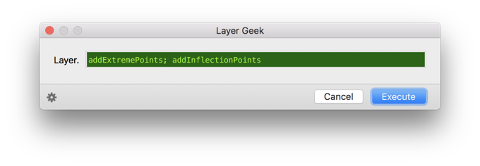

# LayerGeek.glyphsFilter

This is a plugin for the [Glyphs font editor](http://glyphsapp.com/) by Georg Seifert.
It provides a GUI for batch-executing Python and PyObjC methods on selected layers. For an overview of available layer methods, type `help(GSLayer)` and press the *Run* button in the Macro Window. You can run a series of methods if you concatenate them with semicolons. Its true power, however, lies in its use as Custom Parameter. See further below for details.

After installation, it will add the menu item *Filter > Layer Geek*.
You can set a keyboard shortcut in System Preferences.

### Installation

1. Download the complete ZIP file and unpack it, or clone the repository.
2. Double click the .glyphsFilter file. Confirm the dialog that appears in Glyphs.
3. Restart Glyphs

### Usage Instructions

1. Select any number of glyphs in Font or Edit view.
2. Use *Filter > Layer Geek* to bring up the Layer Geek window.

### Custom Parameter

In *File > Font Info > Instances*, add a new Custom Parameter to an instance. You can trigger the filter with the filter key `LayerGeek`, e.g.:

    Property: Filter
    Value: LayerGeek;correctPathDirection()

Call multiple functions with semicolon as separator:

    Property: Filter
    Value: LayerGeek;correctPathDirection();removePathAtIndex_(0);correctPathDirection()

Empty parentheses are optional. So you could type the same Value like this:

    Property: Filter
    Value: LayerGeek;correctPathDirection;removePathAtIndex_(0);correctPathDirection

Only process certain glyphs with `include:` as the last argument in the chain:

    Property: Filter
    Value: LayerGeek;roundCoordinates;include:A,H,N

Or exclude certain glyphs from processing with `exclude:` as the last argument:

    Property: Filter
    Value: LayerGeek;roundCoordinates;exclude:C,c,O,o,G,g,B,b

You can also use the *Copy Custom Parameter for Instance* button in the Layer Geek window to copy the current input into the clipboard, and then, paste it in the Custom Parameter list in *File > Font Info > Instances*. Make sure you click into the parameter list field before pasting.

### Usage Examples

Here are some values and what they do:

    correctPathDirection();removePathAtIndex_(0);correctPathDirection()

This removes the outermost path and corrects path direction.

    makeFirstComponent_(Layer.componentAtIndex_(1))

This takes the second component and makes it the first one. You can use `Layer` for a nested reference to the Layer object.

    removeComponentAtIndex_(Layer.componentCount()-1)

Removes the last component.

    addExtremePoints();cleanUpPaths();

Adds extremes and cleans up paths (like *Layer > Tidy up path*).

    removeAnchorWithName_("bottom")

Removes bottom anchors.

    setHints_(None);setGuideLines_(None)

Deletes all hints and guidelines.

### System Requirements

This plugin needs Glyphs 1.4.3 or later, running on OS X 10.7 or later. It has only been tested on OS X 10.9, though.

### License

Copyright 2014 Rainer Erich Scheichelbauer (@mekkablue).
Based on sample code by Georg Seifert (@schriftgestalt).

Licensed under the Apache License, Version 2.0 (the "License");
you may not use this file except in compliance with the License.
You may obtain a copy of the License at

http://www.apache.org/licenses/LICENSE-2.0

See the License file included in this repository for further details.
